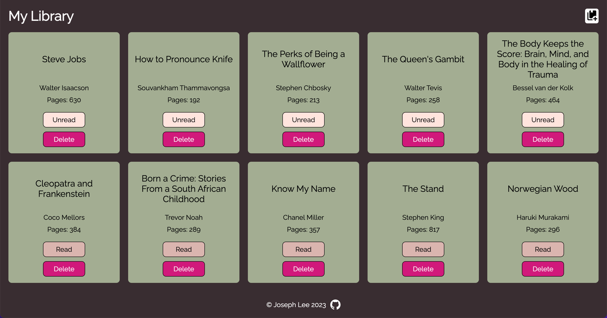
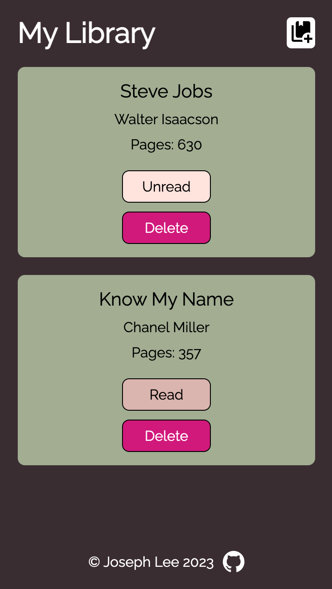

# Library

My implementation of the library project for The Odin Project. Try it [here](https://jooo-lee.github.io/library/)!

## Description:

This is a small library web application that allows users to keep track of books that they have read already or want to read in the future.

For larger screens:

For smaller screens:

## Features:

-   Pop-up modal with a form for adding new books
-   Client-side form validation
    -   Prevents users from adding duplicate books
    -   Only allows positive integers as page number input
-   Button to toggle read/unread status
-   Delete book button
-   Local storage to save user's books in browser

## I learned how to:

-   Use object constructors (refactored to use classes)
-   Create a pop-up modal with a form for users to submit data
-   Dynamically create and display DOM elements
-   Link DOM elements with corresponding array element so deletion works correctly
-   Store data in local storage

## Future features:

-   Display total number of books
-   Sort books by title, author, pages, etc.
-   Filter by read or unread
-   Add "reading" option to read/unread status
-   Allow users to rate books
-   Allow users to edit books
-   Display book cover

## Acknowledgements:

[Open modal icon](https://pictogrammers.com/library/mdi/icon/book-plus-multiple/) from [Pictogrammers](https://pictogrammers.com).

[Favicon](https://favicon.io/emoji-favicons/bookmark/) from [Favicon.io](https://favicon.io/) and [Twemoji](https://twemoji.twitter.com/).
